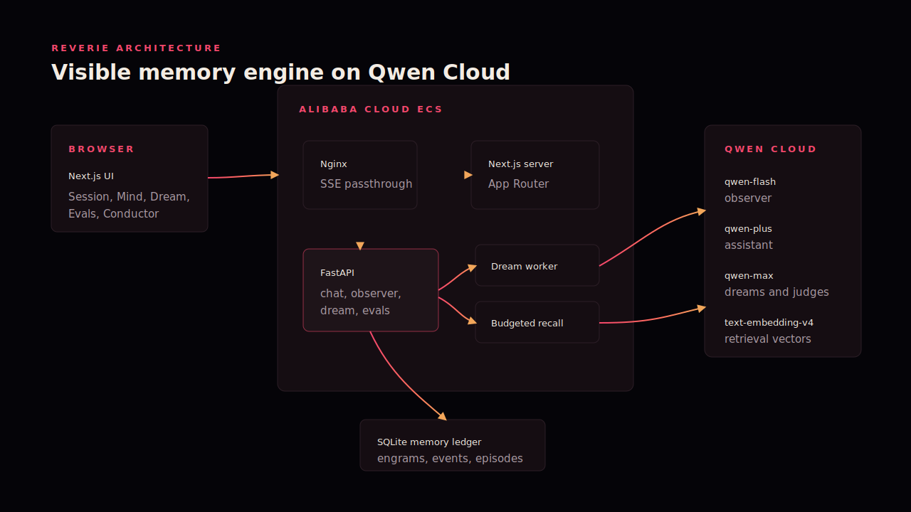

# Reverie


> **Conversations end. Memories shouldn't.**

Reverie is a visible, subject-agnostic memory agent built for **Track 1 —
MemoryAgent**. It turns conversations into evidence-backed memories, consolidates
what matters, forgets stale context, and recalls only what fits a fixed token
budget.

## Submission evidence

| Requirement | Evidence |
| --- | --- |
| Qwen Cloud API usage | [Production endpoint and model routing](https://github.com/anujk22/Reverie/blob/main/backend/app/config.py) |
| Alibaba Cloud deployment | [Historical ECS deployment record](docs/ALIBABA_DEPLOYMENT_PROOF.md) |
| Architecture | [System diagram](docs/diagram.svg) and [technical notes](docs/ARCHITECTURE.md) |
| Measured behavior | [Frozen live evaluation](EVALS.md) and [evaluation harness](backend/app/evals/runner.py) |
| Reproducible deployment | [ECS deployment guide](docs/DEPLOY.md) and [`deploy.sh`](deploy.sh) |

The complete Docker Compose stack ran on Alibaba Cloud ECS in the US (Silicon
Valley) region. The instance was released after evidence capture; visual proof is
included directly in the Devpost submission.

## ✨ What Reverie does

Context windows replay history. Reverie maintains memory.

- **Evidence-backed extraction** — every memory retains its exact source quote.
- **Typed memory** — preferences, goals, affect, misconceptions, facts, mastery,
  and strategy outcomes follow explicit lifecycle rules.
- **Dream consolidation** — `qwen-max` distills, deduplicates, and reconciles
  memories between sessions.
- **Intentional forgetting** — reinforcement and Ebbinghaus-style decay keep
  useful context strong while stale context fades.
- **Budgeted recall** — semantic relevance, strength, recency, and type priors
  compete for a 1,200-token context budget.
- **Visible provenance** — the interface exposes the memory graph, source
  receipts, lifecycle events, and retrieval spend.

The core engine contains no scenario-specific knowledge. Subject vocabulary is
isolated to [`backend/app/subject.py`](backend/app/subject.py), and
[`test_engine_purity.py`](backend/tests/test_engine_purity.py) enforces that
boundary.

## 🧠 Architecture



1. `qwen-flash` observes an exchange and proposes typed memories.
2. Deterministic quote gates reject unsupported candidates.
3. SQLite stores engrams, vectors, provenance, and an append-only event audit.
4. `qwen-max` consolidates memory; `text-embedding-v4` supports retrieval.
5. A budgeted memory pack gives `qwen-plus` only the most useful context.

See [`docs/ARCHITECTURE.md`](docs/ARCHITECTURE.md) for the full component and
data-flow contract.

## ☁️ Qwen on Alibaba Cloud

All model roles use the DashScope OpenAI-compatible endpoint:

```text
https://dashscope-intl.aliyuncs.com/compatible-mode/v1
```

| Role | Model |
| --- | --- |
| Conversation | `qwen-plus` |
| Memory observation | `qwen-flash` |
| Consolidation and evaluation | `qwen-max` |
| Semantic retrieval | `text-embedding-v4` |

The endpoint remains environment-configurable in
[`backend/app/config.py`](backend/app/config.py), and
[`backend/app/llm.py`](backend/app/llm.py) initializes the client without
hardcoding credentials. Deployment facts and the evidence boundary are documented
in [`docs/ALIBABA_DEPLOYMENT_PROOF.md`](docs/ALIBABA_DEPLOYMENT_PROOF.md).

## Results

The frozen live evaluation compares identical three-session workloads:

| Result | No memory | Full history | Reverie |
| --- | ---: | ---: | ---: |
| Personalization mean | 1.0 | 2.5 | **4.7** |
| Reply-context tokens | 7,271 | 32,764 | **10,598** |

Reverie used **68% fewer reply-context tokens than full history**, passed all six
scripted retrieval checks, and passed the forgetting check. These are controlled
synthetic workload results—not a user study or production benchmark. The complete
method and frozen results are in [`EVALS.md`](EVALS.md).

## 🚀 Run locally

```bash
cp .env.example .env
# Add your DASHSCOPE_API_KEY to .env
docker compose up --build
```

Open <http://localhost:3000> and verify the backend at
<http://localhost:8000/api/health>.

### Verification

```bash
python3.11 -m venv backend/.venv311
backend/.venv311/bin/pip install -r backend/requirements.txt
backend/.venv311/bin/pytest backend/tests

cd frontend
npm ci
npm run lint
npm run typecheck
npm run build
```

## License

[MIT](LICENSE)
