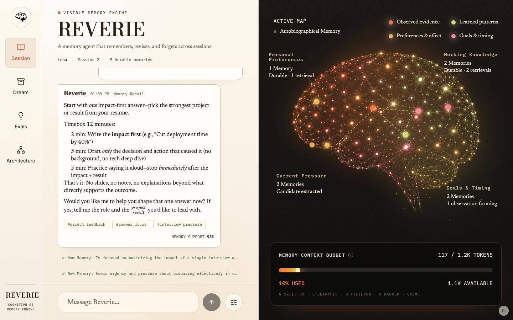

# Reverie



Reverie is a visible memory engine: extraction with provenance receipts, dream consolidation, Ebbinghaus decay, and budgeted retrieval are all watchable in real time.

Headline result from the frozen live evaluation: **4.7 personalization for Reverie vs 1.0 with no memory**, with **68% fewer reply-context tokens than full history**. See the full run in [EVALS.md](./EVALS.md).

The film demo follows one person under pressure across two sessions. Lena is preparing for a final interview. Reverie remembers that the date moved from Friday to Monday, that she corrected an overexplaining habit, that she wants one question at a time with direct feedback, and that she froze in the previous interview. It keeps the correction, lets outdated context fade, and adapts the next answer without replaying her transcript.

The engine contains zero domain knowledge. Swap one script file and the same engine remembers a customer across support tickets, a patient across visits, an engineer across a codebase. The test suite proves it.

Memory is the missing layer for any AI that serves the same human twice: a candidate across interview rounds, a patient across visits, a customer across tickets. Context windows aren't memory; they are cost. Reverie makes memory a first-class, inspectable, budgeted system. It remembers not just what changed but how the user felt, and adapts.

What is inside:

- Dream cycle with schema-gated Qwen judges for distillation, duplicate/refinement checks, contradiction handling, and deterministic memory updates.
- Budgeted retrieval with a measured relevance gate, visible selection reasons, pipeline counts, token usage, and excluded memories.
- Event-audited memory with provenance-verified extraction, visible consolidation, reinforcement, decay, archive, correction, supersession, and explicit forgetting.
- Eval harness for no-memory, full-history, and Reverie conditions. Live runs write `EVALS.md`; mock runs stay marked `real_run=false`.


## Qwen Cloud and Alibaba Cloud

Reverie uses the Qwen Cloud DashScope OpenAI-compatible API. The configured base
URL is `https://dashscope-intl.aliyuncs.com/compatible-mode/v1`.

The literal endpoint and model IDs are configured in
[backend/app/config.py](backend/app/config.py). The OpenAI-compatible client is
initialized with the DashScope API key and base URL in
[backend/app/llm.py](backend/app/llm.py).

The production deployment runs on Alibaba Cloud ECS using Docker Compose and
Nginx. Deployment screenshots are submitted separately through Devpost and are
not placed inside this repository.

Models used:

- `qwen-plus` for assistant responses
- `qwen-flash` for observation and extraction
- `qwen-max` for dream consolidation and judging
- `text-embedding-v4` for embeddings and retrieval

## Quickstart

```bash
cp .env.example .env
docker compose up --build
```

Set `DASHSCOPE_API_KEY` in `.env` for live Qwen calls. Local deterministic fallback:

```bash
MOCK_LLM=true docker compose up --build
```

The UI shows a `MOCK` chip whenever the backend has no `DASHSCOPE_API_KEY`, marking the deterministic offline fallback. `GET /api/health` reports `"mock"` and the live Qwen model IDs so you can verify which mode you're in.

Frontend: http://localhost:3000<br>
Backend health: http://localhost:8000/api/health

## Useful Links

- Demo video: [PASTE YOUR PUBLIC PROJECT DEMO VIDEO URL HERE]
- Eval results: [EVALS.md](./EVALS.md)
- Submission checklist: [docs/SUBMISSION_CHECKLIST.md](./docs/SUBMISSION_CHECKLIST.md)
- Submission audit: [scripts/submission-audit.sh](./scripts/submission-audit.sh)
- Historical build log: [docs/PROGRESS.md](./docs/PROGRESS.md)
- Architecture: [docs/ARCHITECTURE.md](./docs/ARCHITECTURE.md)
