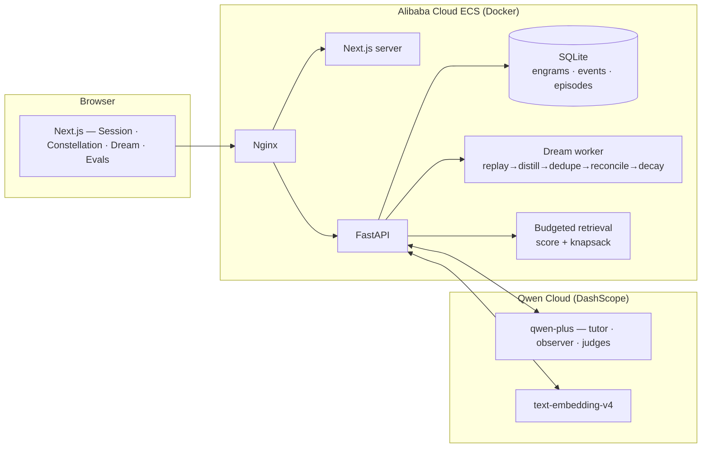

# Reverie Architecture

The frontend never invents memory state. It renders initial graph state from `/api/memory/graph` and then animates the append-only event stream from `/api/events/stream`.

## Vector Search Ruling

Fable's sqlite-vec ruling: after the sqlite-vec timebox, Reverie defaults to brute-force NumPy vector search at demo scale. The current SQLite JSON vector table keeps storage simple and predictable for M0-M7; the upgrade path is to add a sqlite-vec-backed index behind the existing retrieval boundary, backfill it from `engram_vectors`, compare recall and latency against the brute-force path, then switch the default only when the measured row count or latency justifies the extension packaging risk.
