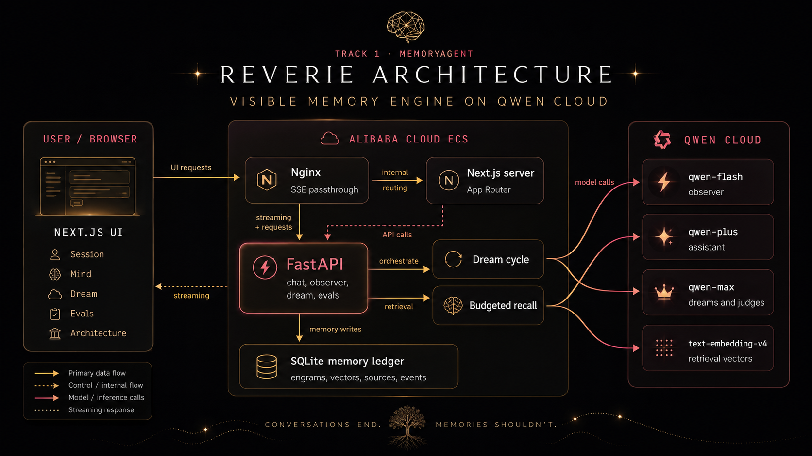
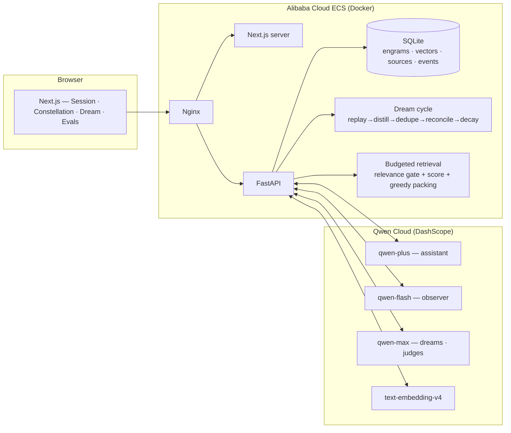

# Reverie Architecture

Reverie is a subject-agnostic memory engine: the core pipeline extracts typed
observations about a person, consolidates them during a dream cycle, decays or
supersedes stale memories, and assembles a budgeted recall pack before the next
response. The demo scenario is the hardest memory workload we could give it: one
person, under pressure, returning across multiple sessions over days.

The core memory algorithms contain zero demo-domain knowledge. Demo vocabulary is
isolated to `backend/app/subject.py` and the eval scripts; swap that subject layer
and the same engine can remember a customer across support tickets, a patient across
visits, or an engineer across a codebase. A purity test enforces that boundary. The Spanish-conjugation
acceptance tests in [`backend/tests/test_dedupe.py`](../backend/tests/test_dedupe.py)
exercise the duplicate guard outside the demo subject.

The complete stack was deployed on Alibaba Cloud ECS before the submission
instance was released. Original visual evidence and the direct Qwen Cloud source
link are in [`ALIBABA_DEPLOYMENT_PROOF.md`](./ALIBABA_DEPLOYMENT_PROOF.md).

The frontend never invents memory state. It renders graph state from `/api/memory/graph`, retrieval evidence returned with each chat stream, and lifecycle events from `/api/events/stream`. SQLite stores the current materialized memory state plus an append-only audit timeline; the projection is not rebuilt solely from events.

Model routing matches depth to cognitive function: `qwen-flash` handles the high-frequency observer pass after each turn, `qwen-plus` stays focused on assistant conversation, `qwen-max` is reserved for slower dream consolidation and judge calls, and `text-embedding-v4` powers retrieval. The health endpoint reports all role model IDs so a demo can prove which model served each function.

## Product Center

The visible product center is memory, not the interview scenario:

- Observer events create provisional engrams.
- Dream stages replay, distill, deduplicate, reconcile, decay, and report.
- The Active Map renders backend engrams, derived shared-tag relationships, and supersession edges.
- The Context Budget Meter shows searched, filtered, ranked, selected, token, and latency values returned by retrieval.
- The Inspector shows provenance, lifecycle events, retrieval reasons, correction, and explicit forgetting.

## Interface Contract

Each memory capability has judge-visible evidence in the product:

| Surface | Required memory pixel |
| --- | --- |
| Session | live Active Map, memory chips under assistant replies, budget meter |
| Dream | stage rows animated from real `dream_stage` SSE events |
| Evals | charts only from real eval JSON, otherwise honest empty state |
| Architecture | in-app card showing Qwen on Alibaba Cloud and the memory pipeline |

Design tokens remain fixed: `void`, `field`, `field-2`, `starlight`, `dim`,
`faint`, `ember`, `glow`, `sage`, `coral`, and `moth`. Depth comes from field
layering and memory glow; one-pixel lines are reserved for true data or state
relationships, not decorative structure.

## Vector Search Ruling

After the sqlite-vec timebox, Reverie defaults to a direct Python cosine scan at demo scale. The current SQLite JSON vector table keeps storage simple and predictable; the upgrade path is to add a sqlite-vec-backed index behind the retrieval boundary, backfill it from `engram_vectors`, compare recall and latency, then switch only when measured scale justifies the packaging risk.
