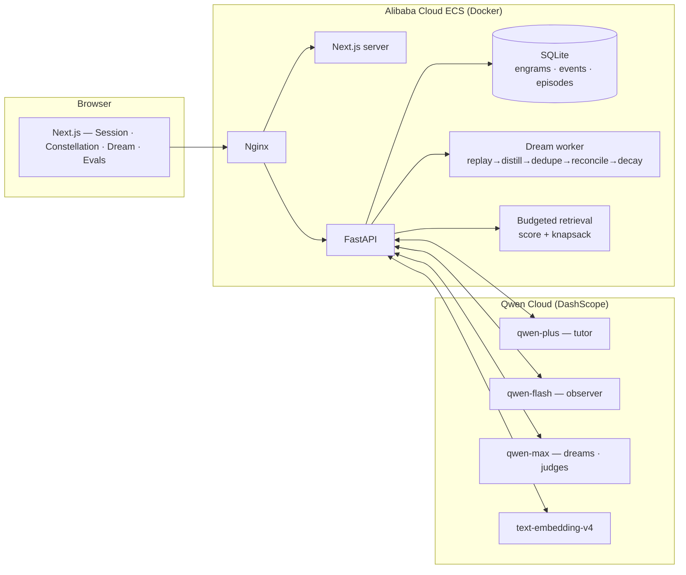

# Reverie Architecture

Reverie is a subject-agnostic memory engine. The tutoring layer is the demo skin:
the core pipeline extracts typed observations about a person, consolidates them
during a dream cycle, decays or supersedes stale memories, and assembles a
budgeted recall pack before the next response. The engine contains zero calculus
knowledge; the subject lives in prompts and scripts. The Spanish-conjugation
acceptance tests in [`backend/tests/test_dedupe.py`](../backend/tests/test_dedupe.py)
prove the duplicate guard without relying on the demo subject.

The frontend never invents memory state. It renders initial graph state from `/api/memory/graph` and then animates the append-only event stream from `/api/events/stream`.

Model routing matches depth to cognitive function: `qwen-flash` handles the high-frequency observer pass after each turn, `qwen-plus` stays focused on tutor conversation, `qwen-max` is reserved for slower dream consolidation and judge calls, and `text-embedding-v4` powers retrieval. The health endpoint reports all role model IDs so a demo can prove which model served each function.

## Product Center

The visible product center is memory, not mathematics:

- Observer events create provisional engrams.
- Dream stages replay, distill, deduplicate, reconcile, decay, and report.
- The Constellation maps the current person-shaped memory graph.
- The Context Budget Meter shows which memories fit inside the response budget.
- The Inspector shows provenance and lifecycle events for a selected memory.

## Interface Contract

The UI follows the PRD design contract that was previously captured in
`docs/DESIGN.md` before being folded into this architecture note:

| Surface | Required memory pixel |
| --- | --- |
| Session | live Constellation, memory chips under tutor replies, budget meter |
| Dream | stage rows animated from real `dream_stage` SSE events |
| Evals | charts only from real eval JSON, otherwise honest empty state |
| Architecture | in-app card showing Qwen on Alibaba Cloud and the memory pipeline |

Design tokens remain fixed: `void`, `field`, `field-2`, `starlight`, `dim`,
`faint`, `ember`, `glow`, `sage`, `coral`, and `moth`. Depth comes from field
layering and memory glow; one-pixel lines are reserved for true data or state
relationships, not decorative structure.

## Vector Search Ruling

Fable's sqlite-vec ruling: after the sqlite-vec timebox, Reverie defaults to brute-force NumPy vector search at demo scale. The current SQLite JSON vector table keeps storage simple and predictable for M0-M7; the upgrade path is to add a sqlite-vec-backed index behind the existing retrieval boundary, backfill it from `engram_vectors`, compare recall and latency against the brute-force path, then switch the default only when the measured row count or latency justifies the extension packaging risk.
